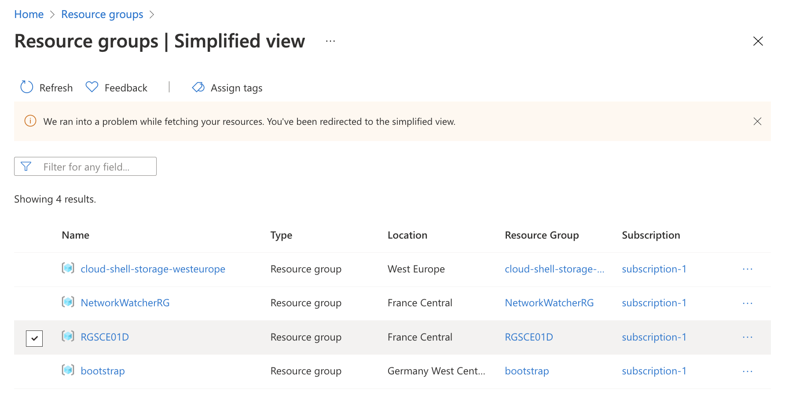
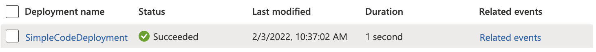
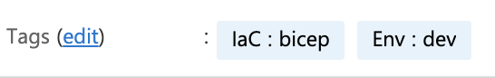
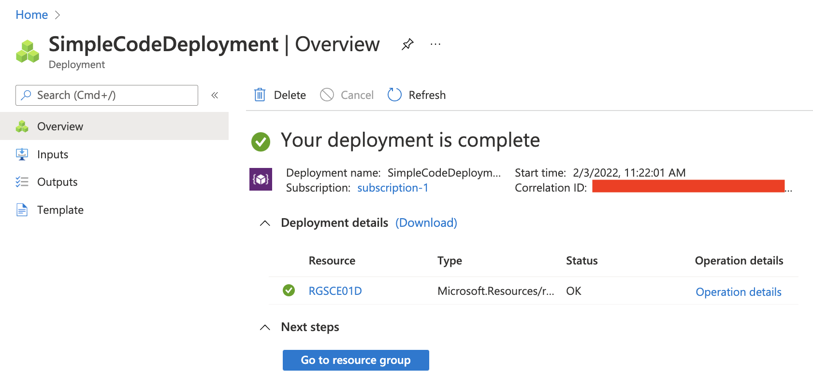
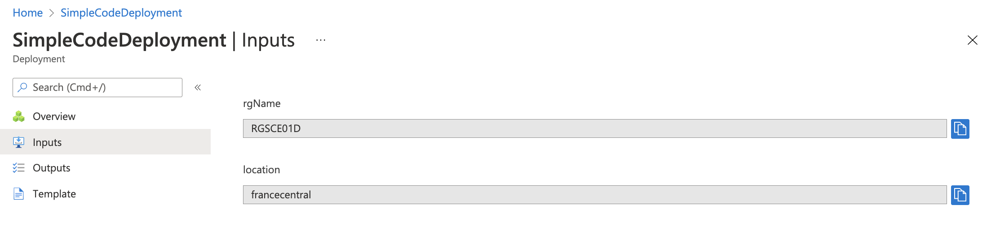
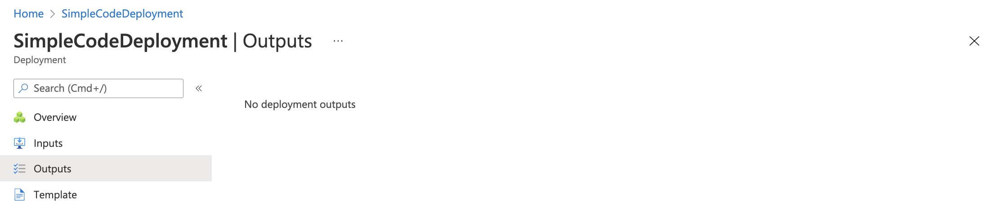
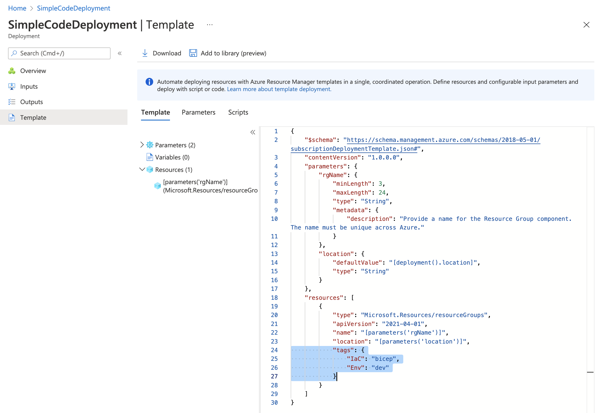

## Documentations Produit

+ [Visitez la document Bicep (page d'acceuil)](https://docs.microsoft.com/en-us/azure/azure-resource-manager/bicep/)
+ [Visitez la documentation de référence pour les Templates ARM (page d'acceuil)](https://docs.microsoft.com/en-us/azure/templates/)

## Principes

### Résumé

> **Définition Microsoft :** Bicep est un langage spécifique à un domaine (DSL) qui utilise la syntaxe déclarative pour déployer des ressources Azure. Dans un fichier Bicep, vous définissez l’infrastructure que vous voulez déployer sur Azure, puis utilisez ce fichier tout au long du cycle de vie de développement pour déployer votre infrastructure à plusieurs reprises. Vos ressources sont déployées de manière cohérente.

Bicep est un langage équivalent à Terraform de Hashicorp mais, pour l'instant, uniquement applicable sur le Cloud Azure.

### Aspects Techniques

Le langage biceps est facilement pris en charge par Visual Studio Code (avec une extension Microsoft). Il est également intégré à **az cli** avec la commande **deployment**. Cette commande traduit le fichier Bicep au format ARM JSON et exécute le déploiement.

## Implémentation

### Contexte de Sécurité

Le contexte de sécurité qui doit être utilisé pour implémenter la description d'un fichier Bicep est le même que lors de l'utilisation de la commande **az cli**.

### Création

#### Un simple exemple de code

Ce simple exemple de code crée un groupe de ressources Azure avec deux paramètres : rgName (qui définit son nom) et location (qui définit son emplacement à partir de l'emplacement de déploiement).

```python
targetScope = 'subscription'

@minLength(3)
@maxLength(24)
@description('Provide a name for the Resource Group component. The name must be unique across Azure.')
param rgName string
param location string = deployment().location

resource bicepRGName 'Microsoft.Resources/resourceGroups@2021-04-01' = {
  name: rgName
  location: location
}
```

#### Déploiement de ce simple exemple

Pour déployer le code précédent, utilisez **az cli** avec la commande **deployment** comme ci-dessous.

```bash
az deployment sub create \
  --name SimpleCodeDeployment \
  --location francecentral \
  --template-file ./simple.bicep \
  --parameters rgName='RGSCE01D'
```

#### Sortie JSON du Déploiement de ce Simple Exemple de Code

```json
{
  "id": "/subscriptions/xxxxxxxx-xxxx-xxxx-xxxx-xxxxxxxxxxxx/providers/Microsoft.Resources/deployments/SimpleCodeDeployment",
  "location": "francecentral",
  "name": "SimpleCodeDeployment",
  "properties": {
    "correlationId": "xxxxxxxx-xxxx-xxxx-xxxx-xxxxxxxxxxxx",
    "debugSetting": null,
    "dependencies": [],
    "duration": "PT1.3830744S",
    "error": null,
    "mode": "Incremental",
    "onErrorDeployment": null,
    "outputResources": [
      {
        "id": "/subscriptions/xxxxxxxx-xxxx-xxxx-xxxx-xxxxxxxxxxxx/resourceGroups/RGSCE01D"
      }
    ],
    "outputs": null,
    "parameters": {
      "location": {
        "type": "String",
        "value": "francecentral"
      },
      "rgName": {
        "type": "String",
        "value": "RGSCE01D"
      }
    },
    "parametersLink": null,
    "providers": [
      {
        "id": null,
        "namespace": "Microsoft.Resources",
        "providerAuthorizationConsentState": null,
        "registrationPolicy": null,
        "registrationState": null,
        "resourceTypes": [
          {
            "aliases": null,
            "apiProfiles": null,
            "apiVersions": null,
            "capabilities": null,
            "defaultApiVersion": null,
            "locationMappings": null,
            "locations": [
              "francecentral"
            ],
            "properties": null,
            "resourceType": "resourceGroups"
          }
        ]
      }
    ],
    "provisioningState": "Succeeded",
    "templateHash": "10133175563902546673",
    "templateLink": null,
    "timestamp": "2022-02-03T09:37:02.658278+00:00",
    "validatedResources": null
  },
  "tags": null,
  "type": "Microsoft.Resources/deployments"
}
```

#### Résultat sur le Portail Azure

Le "Resource Group" **RGSCE01D** dans le Portail Azure


Le **deployment** **SimpleCodeDeployment** dans le Portail Azure


### Mise à Jour

#### Mise à Jour du Code

```python
resource bicepRGName 'Microsoft.Resources/resourceGroups@2021-04-01' = {
  name: rgName
  location: location
  tags: {
    IaC: 'bicep'
    Env: 'dev'
  }
}
```

#### Test de la mise à jour avec What-If

```bash
az deployment sub what-if \
  --name SimpleCodeDeployment \
  --location francecentral \
  --template-file ./simple.bicep \
  --parameters rgName='RGSCE01D'
```

#### Résultat du test de déploiement avec What-If

```bash
Note: The result may contain false positive predictions (noise).
You can help us improve the accuracy of the result by opening an issue here: https://aka.ms/WhatIfIssues

Resource and property changes are indicated with these symbols:
  + Create
  ~ Modify

The deployment will update the following scope:

Scope: /subscriptions/xxxxxxxx-xxxx-xxxx-xxxx-xxxxxxxxxxxx

  ~ resourceGroups/RGSCE01D [2021-04-01]
    + tags:

        Env: "dev"
        IaC: "bicep"


Resource changes: 1 to modify.
```

#### Mise à jour du Déploiement

C'est exactement la même commande que celle de création.

```bash
az deployment sub create \
  --name SimpleCodeDeployment \
  --location francecentral \
  --template-file ./simple.bicep \
  --parameters rgName='RGSCE01D'
```

#### Sortie JSON de la mise à jour du Déploiement

Sortie JSON de la mise à jour du Déploiement

```json
{
  "id": "/subscriptions/xxxxxxxx-xxxx-xxxx-xxxx-xxxxxxxxxxxx/providers/Microsoft.Resources/deployments/SimpleCodeDeployment",
  "location": "francecentral",
  "name": "SimpleCodeDeployment",
  "properties": {
    "correlationId": "xxxxxxxx-xxxx-xxxx-xxxx-xxxxxxxxxxxx",
    "debugSetting": null,
    "dependencies": [],
    "duration": "PT0.8033632S",
    "error": null,
    "mode": "Incremental",
    "onErrorDeployment": null,
    "outputResources": [
      {
        "id": "/subscriptions/xxxxxxxx-xxxx-xxxx-xxxx-xxxxxxxxxxxx/resourceGroups/RGSCE01D"
      }
    ],
    "outputs": null,
    "parameters": {
      "location": {
        "type": "String",
        "value": "francecentral"
      },
      "rgName": {
        "type": "String",
        "value": "RGSCE01D"
      }
    },
    "parametersLink": null,
    "providers": [
      {
        "id": null,
        "namespace": "Microsoft.Resources",
        "providerAuthorizationConsentState": null,
        "registrationPolicy": null,
        "registrationState": null,
        "resourceTypes": [
          {
            "aliases": null,
            "apiProfiles": null,
            "apiVersions": null,
            "capabilities": null,
            "defaultApiVersion": null,
            "locationMappings": null,
            "locations": [
              "francecentral"
            ],
            "properties": null,
            "resourceType": "resourceGroups"
          }
        ]
      }
    ],
    "provisioningState": "Succeeded",
    "templateHash": "12797740713950331154",
    "templateLink": null,
    "timestamp": "2022-02-03T10:22:02.084855+00:00",
    "validatedResources": null
  },
  "tags": null,
  "type": "Microsoft.Resources/deployments"
}
```

#### Résultat sur le Portail Azure

> ...


### Gestion des Déploiements

#### Azure Portal Deployment Overview



#### Azure Portal Deployment Inputs



#### Azure Portal Deployment Outputs



#### Azure Portal Deployment Template


