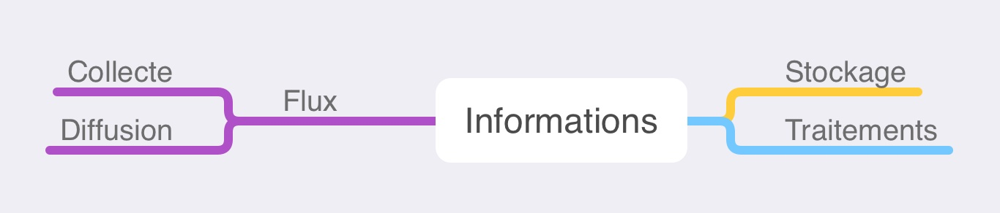
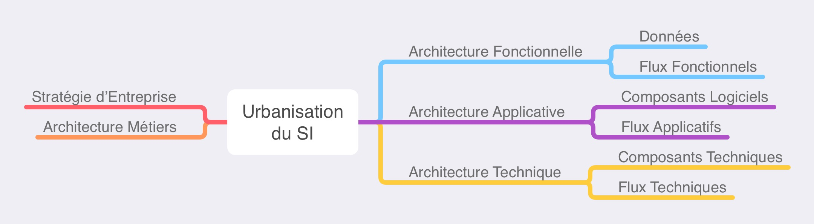

## Objectif

L'objectif de cet article est de proposer un exemple d'Infrastructure de SI dans le Cloud.
Celle-ci pourra, si nécessaire, être reliée avec une infrastructure non Cloud hébergeant les applications historiques de l'Entreprise.

### Vocabulaire

Pour commencer, mettons nous d'accord sur quelques éléments de langage. Ces quelques définitions étant évidemment un résumé rapide d'un ensemble de notions complexes, il va sans dire (mais c'est tout de même mieux en le disant 😅) qu'elles peuvent être incomplètes, imprécises ou inexactes en regard de l'état de l'Art. Elle permettent donc avant tout d'avoir un langage commun pour la compréhension de l'article.

|Item|Schéma|Description|
|:--:|:----:|-----------|
|**SI**|  |"Un **S**ystème d'**I**nformation (**SI**) est un ensemble organisé de ressources qui permet de collecter, stocker, traiter et diffuser de l'information" ([SI](https://fr.wikipedia.org/wiki/Système_d%27information))|
|**Urbanisation** du SI||"L'urbanisation du SI d'une entité ou d'une organisation, qui peut être une entreprise ou une administration, est une discipline d’ingénierie informatique consistant à faire évoluer le SI de celle-ci afin qu'il soutienne et accompagne efficacement les missions de ladite organisation et anticipe ses transformations" ([Urbanisation du SI](https://fr.wikipedia.org/wiki/Urbanisation_(informatique))). L'urbanisation du SI répond à la stratégie de l'Entreprise en regard de l'Architecture ***Métiers***. Cette dernière est modélisée en couche d'architecture : ***Fonctionnelle***, ***Applicative*** et ***Technique***.|
|**Infrastructure** du SI|||