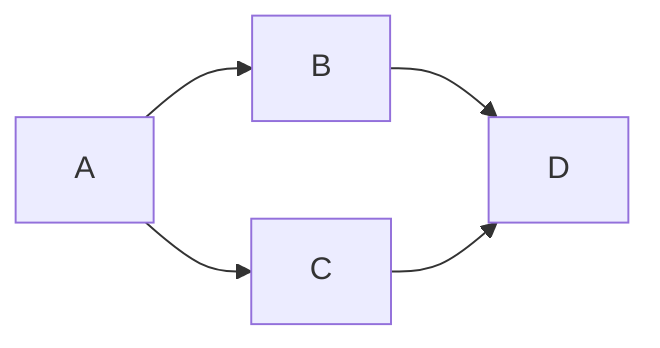

> J'utiliserais ce premier article pour montrer ce qu'il est possible de publier ***simplement*** avec **HUGO** en ***markdown***.\
> Celui sera donc amené à être mis à jour régulièrement...

## Des meta-données pour le ***header*** de l'article

Ces méta-données sont directement définies en haut de cette article dans le fichier markdown.

```yaml
---
# draft: true
image: "my-first-post.jpg"
title: "Mon Premier Article"
date: 2022-02-26
categories:
  - IaC
  - Archi
  - Code
# ...
```

Le résultat est visible tput en haut.

## Publier du code (code block) avec HUGO

Un premier exemple simple pour du ***bash*** :

```bash {linenos=false}
echo "Date: $(date)"
echo "Mon premier article avec Hugo !"
```

Un autre exemple pour du ***terraform*** :

```terraform
resource "a_resource" "my_resource_name" {
  key = "value"
  anotherkey = "another value"
}
```

Et enfin utiliser un ***Code Block*** avec ***mermaid** pour dessiner un petit graphe :



## D'autres meta-données pour le ***footer*** de l'article

Ces méta-données sont directement définies en haut de cette article dans le fichier markdown.

```yaml
# ...
tags:
  - code blocks
  - mermaid
#licence: Sous une licence spécifique 
lastmod: 2022-03-19
---
```

Le résultat est visible ci-dessous.
