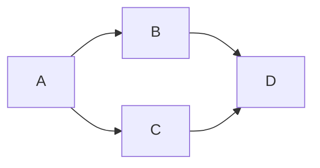

> Il est facile de publier un article depuis un fichier ***markdown*** avec **Hugo**.\
> Celui-ci est un simple exemple de ce qu'il est possible de faire. Il ne s'agit pas d'un tutoriel sur **Hugo**.

## Des meta-données pour le ***header*** de l'article

Ces méta-données sont directement définies dans le haut du fichier ***markdown*** de cet article.

```yaml
---
# draft: true
image: "my-first-post.jpg"
title: "Mon Premier Article"
date: 2022-02-26
categories:
  - IaC
  - Archi
  - Code
# ...
```

Le résultat est visible avant le début de l'article.

## Publier du code (code block) avec HUGO

Un premier exemple simple pour du ***bash*** :

```bash {linenos=false}
echo "Date: $(date)"
echo "Mon premier article avec Hugo !"
```

Un autre exemple pour du ***terraform*** :

```terraform
resource "a_resource" "my_resource_name" {
  key = "value"
  anotherkey = "another value"
}
```

Et enfin utiliser un ***Code Block*** avec ***mermaid*** pour dessiner un petit graphe :



## D'autres meta-données pour le ***footer*** de l'article

Ces méta-données sont aussi directement définies dans le haut du fichier ***markdown*** de cet article.

```yaml
# ...
tags:
  - code blocks
  - mermaid
#licence: Sous une licence spécifique 
lastmod: 2022-03-19
---
```

Le rendu est visible ci-dessous.
